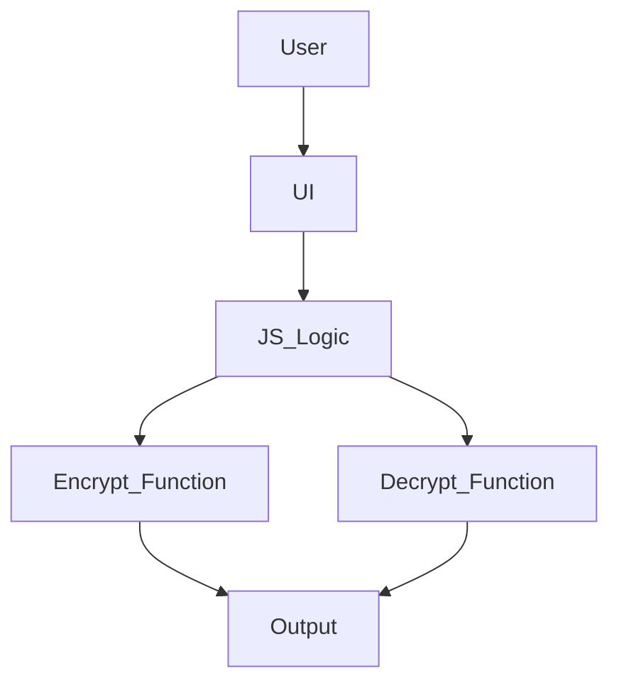
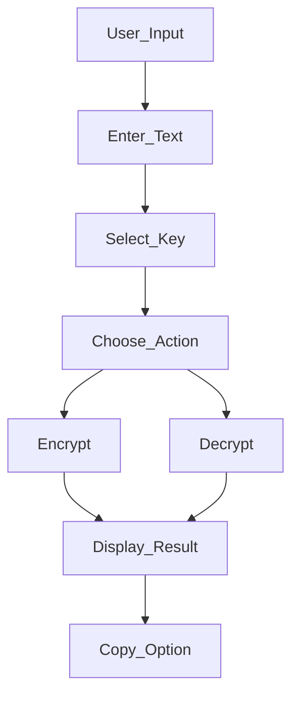

# 🚀 Caesar Cipher Tool

> Encrypt and decrypt text using a classic shift cipher with a clean interactive UI.


---

# 📌 Overview

This project is a simple web-based implementation of the Caesar Cipher, a classic encryption technique where each character in the text is shifted by a fixed number of positions.

I built this to strengthen my understanding of **basic cryptography concepts, string manipulation, and frontend interaction**. It provides an intuitive UI where users can input text, choose a shift key, and instantly encrypt or decrypt messages.

It’s ideal for beginners exploring **encryption basics and JavaScript-based UI logic**.

---

# 🎥 Demo / Screenshots

## 🔹 Main Interface


## 🔹 Encryption Example


## 🔹 Decryption Example


---

# ✨ Features

## Core Features

* Encrypt text using Caesar Cipher
* Decrypt encrypted text
* Adjustable shift key (1–25)
* Instant output display
* Copy-to-clipboard functionality

## Advanced Features

* Handles uppercase and lowercase characters
* Preserves non-alphabet characters (spaces, punctuation)
* Clean responsive UI
* Modular JavaScript logic

---

# 🏗 Architecture



---

# 🔄 System Workflow



---

# 🛠 Tech Stack

| Layer    | Technology                       |
| -------- | -------------------------------- |
| Frontend | HTML, CSS, JavaScript            |
| Logic    | JavaScript (String manipulation) |

---

# 📂 Project Structure

```
Caesar_Cipher/

├── index.html
├── style.css
├── script.js
├── docs/
│   └── screenshots/
└── README.md
```

---

# ⚙️ Installation

### 1 Clone the repository

```
git clone https://github.com/harsh-verma-2004/Caesar_Cipher.git
```

### 2 Navigate to project

```
cd Caesar_Cipher
```

### 3 Run the project

Just open the file:

```
index.html
```

---

# 📊 Performance Considerations

* Lightweight frontend application
* No backend dependency → instant response
* Efficient string manipulation logic
* Runs entirely in browser

---

# 🗺 Roadmap

* Add support for other ciphers (Vigenère, AES basics)
* Improve UI animations
* Add dark/light theme toggle
* Deploy as a web app

---

# 👨‍💻 Author

Harsh Verma
GitHub: [https://github.com/harsh-verma-2004](https://github.com/harsh-verma-2004)

---

# ⭐ Support

If you like this project, consider giving it a star ⭐
